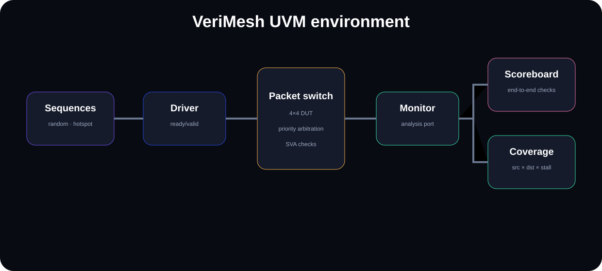

# VeriMesh

<p align="center"></p>

<p align="center"></p>

**Reusable UVM verification environment for a configurable packet switch.**

VeriMesh pairs a synthesizable ready/valid 4×4 packet-switch DUT with a class-based UVM environment: transactions, constrained-random sequences, sequencer, driver, monitor, scoreboard, subscriber coverage and protocol assertions.

## Verification architecture

```text
random/hotspot sequences → driver → DUT → monitor ─┬→ scoreboard
                                                    └→ functional coverage
                                      assertions watch backpressure semantics
```

## What is covered

- constrained-random source, destination, payload and stall behavior
- directed hotspot sequence to force arbitration conflicts
- reusable `uvm_sequence_item` transaction
- separate accepted-input and output monitors
- analysis-port fanout
- end-to-end scoreboard with per-destination expected queues
- source × destination cross coverage sampled from accepted traffic
- stall-cycle coverage bins
- SystemVerilog Assertions for output-valid stability under backpressure
- simulator targets for Questa, VCS and Xcelium

## Run

Commercial simulators:

```bash
make questa TEST=switch_base_test
make vcs TEST=switch_hotspot_test
make xrun TEST=switch_base_test
```

Open-source CI now does three things: lints the synthesizable RTL, runs the Python reference model, **and builds/runs the UVM testbench with Verilator 5.052 plus the Verilator-compatible UVM library**. The same environment still has Make targets for Questa, VCS, and Xcelium.

Verilator 5.052 added UVM 2020-3.2 support, so this repository uses that open-source path as a real regression rather than treating UVM as documentation-only.

## DUT behavior

Each input supplies a destination port and a 32-bit payload. For every output, the lowest-index valid requester wins that cycle. Backpressure propagates to the winning input through `in_ready`. The simple arbitration rule is intentionally deterministic so the verification environment can concentrate on reusable UVM mechanics and corner cases.

## Repo map

```text
rtl/packet_switch.sv       DUT
rtl/packet_switch_sva.sv   assertions
uvm/switch_item.sv         transaction
uvm/switch_sequence.sv     random + hotspot sequences
uvm/switch_driver.sv       stimulus
uvm/switch_monitor.sv      observation
uvm/switch_scoreboard.sv   checking
uvm/switch_coverage.sv     functional coverage
uvm/switch_env.sv          environment
uvm/switch_test.sv         tests
```

## Standard target

The environment is written against standard UVM APIs. Accellera's current UVM reference implementation tracks IEEE 1800.2; no proprietary verification framework is embedded in the repo.
